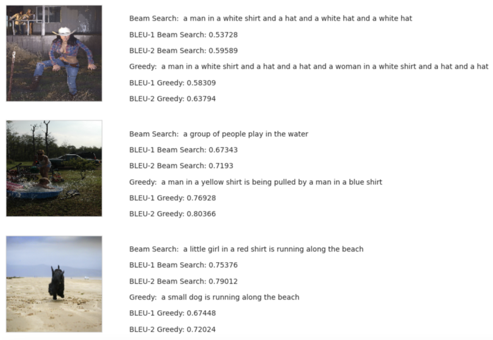
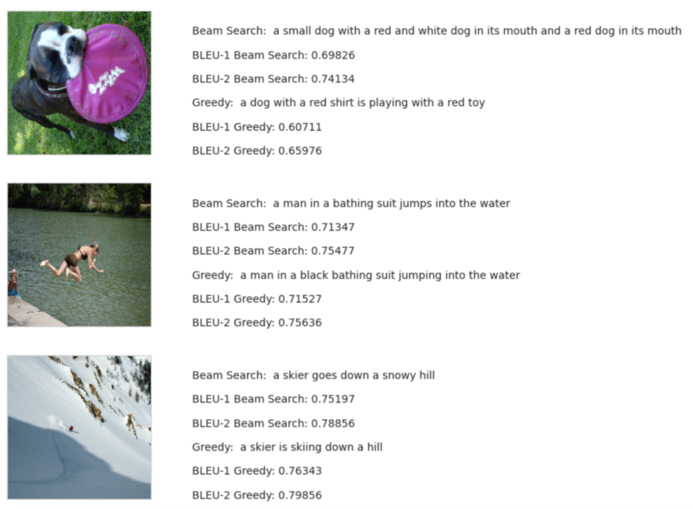

# SnapSpeak – Image Captioning

## Abstract

This study explores deep learning techniques for image captioning, combining computer vision and natural language processing to generate textual descriptions for images. Using the Flickr8k dataset, it employs InceptionV3 for feature extraction and evaluates LSTM and GRU architectures for sequence generation. Preprocessing includes image resizing and caption tokenization. 

Model performance is assessed using BLEU-1 and BLEU-2 scores, with Beam Search outperforming Greedy Search in caption generation. While LSTMs excel at capturing long-term dependencies, GRUs offer faster training with comparable performance. 

The research demonstrates potential applications in assistive technologies, metadata generation, and content creation. It highlights the importance of preprocessing and advanced search techniques while addressing challenges such as dataset limitations. Future work includes scaling with larger datasets and exploring transformer-based architectures for improved results.

---

## Dataset

The dataset used for this approach is the **Flickr8k** dataset.

- **Dataset Size**:
  - Images: 8,091 images in total.
  - Captions: 5 or 6 captions per image, resulting in 40,460 image-caption pairs.
  - Image format: JPG
  - Dimensions: Images vary in size but are resized to a fixed size (e.g., 224×224 or 299×299) for training models.
  - Content: Real-world scenes including humans, animals, objects, and various activities.

---

## Key Takeaways

- **Dual Decoder Evaluation**: LSTMs were effective at capturing long-term dependencies, making them ideal for complex captions, while GRUs offered faster training with comparable performance for simpler tasks.

- **Importance of Preprocessing**: Preparing the dataset through resizing, tokenization, and adding start/end tokens ensured consistent and efficient learning, particularly for a small dataset like Flickr8k.

- **Beam Search Advantage**: Beam Search produced more fluent and detailed captions compared to Greedy Search, showcasing its importance for generating contextually accurate results.

- **Addressing Dataset Limitations**: Techniques like fine-tuning and data augmentation helped mitigate the challenges of working with a smaller dataset, improving the model's generalization to unseen data.

- **Applications and Scalability**: This work lays the groundwork for assistive technologies, automated tagging, and content creation, with opportunities to scale further using larger datasets and advanced architectures like transformers.

---

## Future Work

1. **Scaling with Larger Datasets**: Explore datasets larger than Flickr8k to improve model performance and generalizability.
2. **Transformer-Based Architectures**: Investigate using transformers for better contextual understanding in caption generation.
3. **Real-Time Systems**: Develop scalable systems for real-time caption generation in applications such as assistive devices.
4. **Dataset Expansion**: Incorporate data from multiple sources to improve diversity and robustness.
5. **Fine-Tuning**: Fine-tune pre-trained models for specific use cases.

---

## Outputs

1. **LSTM - Captions generated using Beam Search and Greedy Search**: 
   
   

2. **GRU - Captions generated using Beam Search and Greedy Search**: 
   
   
